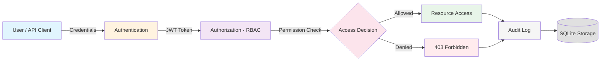
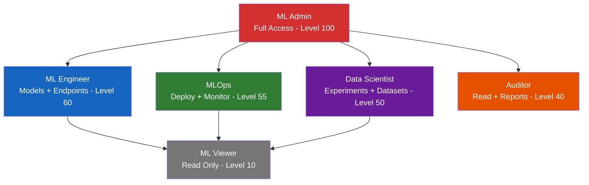
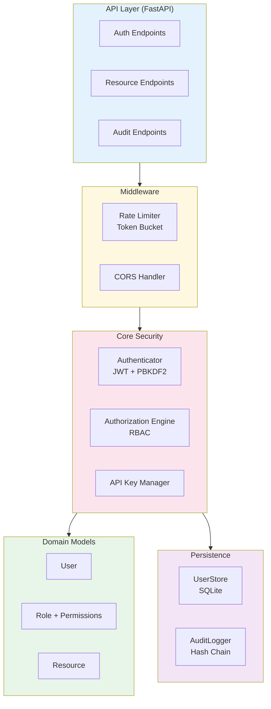

# ML Security RBAC Platform

**Plataforma de Controle de Acesso Baseado em Papeis (RBAC) para Sistemas de Machine Learning**

**Role-Based Access Control (RBAC) Security Platform for Machine Learning Systems**

[](https://www.python.org/downloads/)
[](LICENSE)
[](Dockerfile)
[](https://fastapi.tiangolo.com/)

---

## Sumario / Table of Contents

- [Visao Geral / Overview](#visao-geral--overview)
- [Arquitetura / Architecture](#arquitetura--architecture)
- [Funcionalidades / Features](#funcionalidades--features)
- [Papeis e Permissoes / Roles and Permissions](#papeis-e-permissoes--roles-and-permissions)
- [Inicio Rapido / Quick Start](#inicio-rapido--quick-start)
- [Endpoints da API / API Endpoints](#endpoints-da-api--api-endpoints)
- [Configuracao / Configuration](#configuracao--configuration)
- [Testes / Testing](#testes--testing)
- [Docker](#docker)
- [Aplicacoes na Industria / Industry Applications](#aplicacoes-na-industria--industry-applications)
- [Estrutura do Projeto / Project Structure](#estrutura-do-projeto--project-structure)
- [Autor / Author](#autor--author)
- [Licenca / License](#licenca--license)

---

## Visao Geral / Overview

### PT-BR

O **ML Security RBAC Platform** e uma plataforma de seguranca projetada para proteger sistemas de Machine Learning em producao. Ela implementa controle de acesso baseado em papeis (RBAC), autenticacao JWT, gerenciamento de chaves de API, limitacao de taxa e auditoria completa de acessos.

A plataforma resolve o desafio critico de governanca em ambientes de ML, onde modelos, datasets, experimentos e endpoints precisam de controle granular de acesso para equipes multidisciplinares compostas por cientistas de dados, engenheiros de ML, operadores MLOps e auditores.

### EN

**ML Security RBAC Platform** is a security platform designed to protect Machine Learning systems in production. It implements Role-Based Access Control (RBAC), JWT authentication, API key management, rate limiting, and comprehensive access auditing.

The platform addresses the critical challenge of governance in ML environments, where models, datasets, experiments, and endpoints require granular access control for multidisciplinary teams of data scientists, ML engineers, MLOps operators, and auditors.

---

## Arquitetura / Architecture

### Fluxo de Autenticacao e Autorizacao / Authentication and Authorization Flow



### Hierarquia de Papeis / Role Hierarchy



### Arquitetura de Componentes / Component Architecture



---

## Funcionalidades / Features

### PT-BR

| Funcionalidade | Descricao |
|---|---|
| **Autenticacao JWT** | Tokens de acesso e refresh com HMAC-SHA256, sem dependencias externas |
| **Hashing de Senhas** | PBKDF2-HMAC-SHA256 com 260.000 iteracoes e salt aleatorio |
| **RBAC Hierarquico** | 6 papeis predefinidos com heranca de permissoes |
| **Permissoes Granulares** | Controle por recurso (model, dataset, experiment, endpoint) e acao (read, write, execute, delete, admin) |
| **Chaves de API** | Geracao, validacao e revogacao de chaves programaticas |
| **Limitacao de Taxa** | Token bucket por usuario/IP com configuracao flexivel |
| **Auditoria Completa** | Log de todas as decisoes de acesso com cadeia de hash SHA-256 |
| **Deteccao de Adulteracao** | Hash chain criptografico para garantir integridade dos logs de auditoria |
| **Bloqueio de Conta** | Bloqueio automatico apos tentativas de login falhas |
| **API REST** | FastAPI com documentacao OpenAPI automatica |

### EN

| Feature | Description |
|---|---|
| **JWT Authentication** | Access and refresh tokens with HMAC-SHA256, no external dependencies |
| **Password Hashing** | PBKDF2-HMAC-SHA256 with 260,000 iterations and random salt |
| **Hierarchical RBAC** | 6 predefined roles with permission inheritance |
| **Granular Permissions** | Per-resource (model, dataset, experiment, endpoint) and per-action (read, write, execute, delete, admin) control |
| **API Keys** | Generation, validation, and revocation of programmatic keys |
| **Rate Limiting** | Token bucket per user/IP with flexible configuration |
| **Full Audit Trail** | Logging of all access decisions with SHA-256 hash chain |
| **Tamper Detection** | Cryptographic hash chain ensures audit log integrity |
| **Account Lockout** | Automatic lockout after failed login attempts |
| **REST API** | FastAPI with automatic OpenAPI documentation |

---

## Papeis e Permissoes / Roles and Permissions

| Papel / Role | model | dataset | experiment | endpoint | audit | report |
|---|---|---|---|---|---|---|
| **ml_admin** | * | * | * | * | * | * |
| **ml_engineer** | R/W/X | R/W | R/W/X | R/W/X | - | - |
| **data_scientist** | R/W | R/W | R/W/X | R | - | - |
| **ml_ops** | R/X | - | R | R/W/X/A | - | - |
| **auditor** | R | R | R | R | R | R/W |
| **ml_viewer** | R | R | R | R | - | - |

> R=Read, W=Write, X=Execute, A=Admin, *=All permissions

---

## Inicio Rapido / Quick Start

### Pre-requisitos / Prerequisites

- Python 3.11+
- pip

### Instalacao / Installation

```bash
# Clonar o repositorio / Clone the repository
git clone https://github.com/galafis/ml-security-rbac-platform.git
cd ml-security-rbac-platform

# Instalar dependencias / Install dependencies
pip install -r requirements.txt

# Executar demo CLI / Run CLI demo
python main.py

# Iniciar servidor API / Start API server
uvicorn src.api.server:app --reload --port 8000
```

### Uso Rapido da API / Quick API Usage

```bash
# Registrar usuario / Register user
curl -X POST http://localhost:8000/auth/register \
  -H "Content-Type: application/json" \
  -d '{"username":"alice","email":"alice@example.com","password":"SecureP@ss123!","roles":["ml_engineer"]}'

# Fazer login / Login
curl -X POST http://localhost:8000/auth/login \
  -H "Content-Type: application/json" \
  -d '{"username":"alice","password":"SecureP@ss123!"}'

# Acessar perfil (com token) / Access profile (with token)
curl http://localhost:8000/users/me \
  -H "Authorization: Bearer <access_token>"

# Criar recurso / Create resource
curl -X POST http://localhost:8000/resources \
  -H "Authorization: Bearer <access_token>" \
  -H "Content-Type: application/json" \
  -d '{"name":"fraud-model","resource_type":"model","description":"Fraud detection model"}'
```

---

## Endpoints da API / API Endpoints

| Metodo / Method | Endpoint | Descricao / Description |
|---|---|---|
| `POST` | `/auth/register` | Registrar novo usuario / Register new user |
| `POST` | `/auth/login` | Autenticar e receber tokens JWT / Authenticate and get JWT tokens |
| `POST` | `/auth/refresh` | Renovar token de acesso / Refresh access token |
| `POST` | `/auth/api-keys` | Criar chave de API / Create API key |
| `GET` | `/auth/api-keys` | Listar chaves de API / List API keys |
| `DELETE` | `/auth/api-keys/{hash}` | Revogar chave de API / Revoke API key |
| `GET` | `/users/me` | Perfil do usuario atual / Current user profile |
| `GET` | `/users` | Listar usuarios (admin) / List users (admin only) |
| `POST` | `/resources` | Criar recurso / Create resource |
| `GET` | `/resources` | Listar recursos / List resources |
| `GET` | `/resources/{id}` | Obter recurso / Get resource |
| `PUT` | `/resources/{id}` | Atualizar recurso / Update resource |
| `DELETE` | `/resources/{id}` | Deletar recurso / Delete resource |
| `GET` | `/audit/logs` | Logs de auditoria (admin/auditor) / Audit logs (admin/auditor) |
| `GET` | `/health` | Verificacao de saude / Health check |

Documentacao interativa disponivel em / Interactive documentation at: `http://localhost:8000/docs`

---

## Configuracao / Configuration

### Variaveis de Ambiente / Environment Variables

| Variavel / Variable | Padrao / Default | Descricao / Description |
|---|---|---|
| `AUTH_JWT_SECRET_KEY` | (dev default) | Chave secreta JWT / JWT secret key |
| `AUTH_ACCESS_TOKEN_EXPIRE_MINUTES` | 30 | TTL do token de acesso / Access token TTL |
| `AUTH_REFRESH_TOKEN_EXPIRE_DAYS` | 7 | TTL do token refresh / Refresh token TTL |
| `AUTH_MAX_LOGIN_ATTEMPTS` | 5 | Tentativas antes de bloqueio / Attempts before lockout |
| `RBAC_DEFAULT_ROLE` | ml_viewer | Papel padrao para novos usuarios / Default role for new users |
| `SECURITY_DEBUG` | false | Modo debug / Debug mode |
| `LOG_LEVEL` | INFO | Nivel de log / Log level |

### Arquivo de Configuracao / Configuration File

Veja / See `config/security_config.yaml` para configuracao completa dos papeis, permissoes e politicas de seguranca / for complete configuration of roles, permissions, and security policies.

---

## Testes / Testing

```bash
# Executar todos os testes / Run all tests
pytest tests/ -v

# Testes unitarios / Unit tests only
pytest tests/unit/ -v

# Testes de integracao / Integration tests only
pytest tests/integration/ -v

# Com cobertura / With coverage
pytest tests/ -v --tb=short
```

A suite de testes inclui 50+ assertions cobrindo / The test suite includes 50+ assertions covering:
- Hashing e verificacao de senhas / Password hashing and verification
- Criacao e validacao de tokens JWT / JWT token creation and validation
- Motor de autorizacao RBAC / RBAC authorization engine
- Hierarquia de papeis / Role hierarchy
- CRUD de usuarios e recursos / User and resource CRUD
- Auditoria e cadeia de hash / Audit logging and hash chain
- Gerenciamento de chaves de API / API key management
- Limitacao de taxa / Rate limiting
- Endpoints da API REST / REST API endpoints

---

## Docker

```bash
# Build e executar / Build and run
docker compose -f docker/docker-compose.yml up -d

# Verificar saude / Check health
curl http://localhost:8000/health

# Parar / Stop
docker compose -f docker/docker-compose.yml down
```

---

## Aplicacoes na Industria / Industry Applications

### PT-BR

| Setor | Aplicacao |
|---|---|
| **Plataformas de ML** | Controle de acesso a modelos, datasets e pipelines em plataformas como Kubeflow, MLflow e SageMaker |
| **Saude** | Governanca de acesso a dados clinicos e modelos de diagnostico, conformidade com HIPAA e LGPD |
| **Financeiro** | Controle de acesso a modelos de risco de credito e deteccao de fraude, auditoria para conformidade regulatoria |
| **Sistemas Multi-Tenant** | Isolamento de recursos entre equipes e organizacoes em plataformas ML compartilhadas |
| **MLOps** | Controle de quem pode treinar, implantar e monitorar modelos em ambientes de producao |
| **Pesquisa** | Gerenciamento de acesso a experimentos e datasets sensiveis em laboratorios de pesquisa |

### EN

| Sector | Application |
|---|---|
| **ML Platforms** | Access control for models, datasets, and pipelines on platforms like Kubeflow, MLflow, and SageMaker |
| **Healthcare** | Governance of clinical data access and diagnostic models, HIPAA and GDPR compliance |
| **Financial Services** | Access control for credit risk models and fraud detection, audit trails for regulatory compliance |
| **Multi-Tenant Systems** | Resource isolation between teams and organizations in shared ML platforms |
| **MLOps** | Control over who can train, deploy, and monitor models in production environments |
| **Research** | Managing access to experiments and sensitive datasets in research labs |

---

## Estrutura do Projeto / Project Structure

```
ml-security-rbac-platform/
├── src/
│   ├── api/
│   │   ├── __init__.py
│   │   └── server.py              # FastAPI application
│   ├── auth/
│   │   ├── __init__.py
│   │   ├── authenticator.py       # JWT + password hashing
│   │   └── authorization.py       # RBAC engine
│   ├── models/
│   │   ├── __init__.py
│   │   ├── user.py                # User and UserRole models
│   │   ├── role.py                # Role templates and helpers
│   │   └── resource.py            # Resource and Permission models
│   ├── storage/
│   │   ├── __init__.py
│   │   └── user_store.py          # SQLite persistence
│   ├── audit/
│   │   ├── __init__.py
│   │   └── audit_logger.py        # Audit with hash chain
│   ├── api_keys/
│   │   ├── __init__.py
│   │   └── manager.py             # API key lifecycle
│   ├── middleware/
│   │   ├── __init__.py
│   │   └── rate_limiter.py        # Token bucket limiter
│   ├── config/
│   │   ├── __init__.py
│   │   └── settings.py            # Pydantic settings
│   └── utils/
│       ├── __init__.py
│       └── logger.py              # Structured logging
├── tests/
│   ├── conftest.py                # Shared fixtures
│   ├── unit/                      # Unit tests
│   └── integration/               # API integration tests
├── config/
│   └── security_config.yaml       # Security configuration
├── docker/
│   ├── Dockerfile
│   └── docker-compose.yml
├── .github/
│   └── workflows/
│       └── ci.yml                 # CI pipeline
├── main.py                        # CLI demo
├── requirements.txt
├── Makefile
├── .gitignore
└── README.md
```

---

## Tecnologias / Technologies

| Tecnologia / Technology | Uso / Purpose |
|---|---|
| **Python 3.11+** | Linguagem principal / Core language |
| **FastAPI** | Framework web REST API |
| **SQLite** | Banco de dados embutido / Embedded database |
| **PBKDF2-HMAC-SHA256** | Hashing de senhas / Password hashing |
| **HMAC-SHA256** | Assinatura de tokens JWT / JWT token signing |
| **Pydantic** | Validacao de dados e configuracao / Data validation and configuration |
| **pytest** | Framework de testes / Test framework |
| **Docker** | Containerizacao / Containerization |
| **GitHub Actions** | Integracao continua / Continuous integration |

---

## Autor / Author

**Gabriel Demetrios Lafis**

- GitHub: [@galafis](https://github.com/galafis)
- Email: gabriel.lafis@gmail.com

---

## Licenca / License

Este projeto esta licenciado sob a Licenca MIT. Veja o arquivo [LICENSE](LICENSE) para detalhes.

This project is licensed under the MIT License. See the [LICENSE](LICENSE) file for details.
